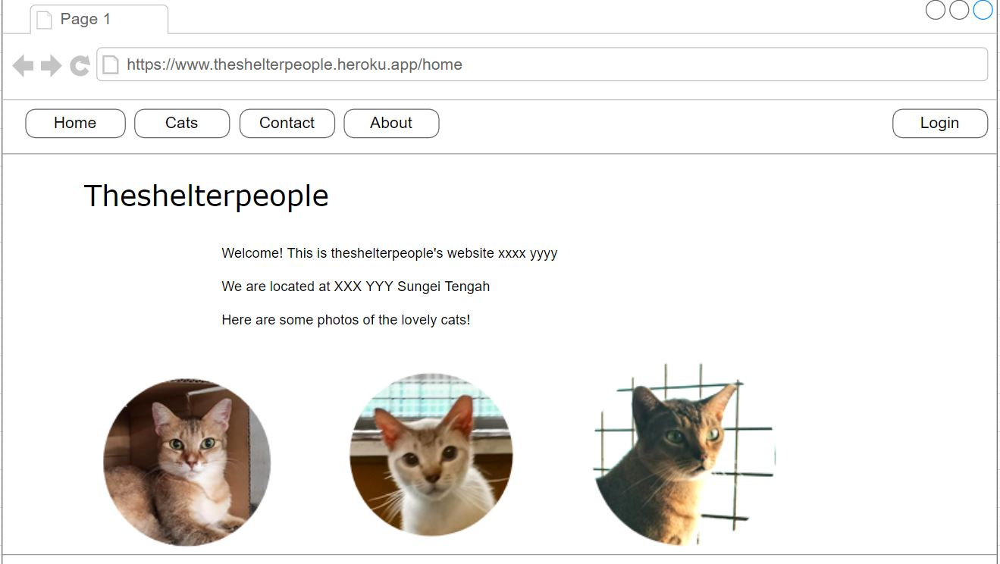
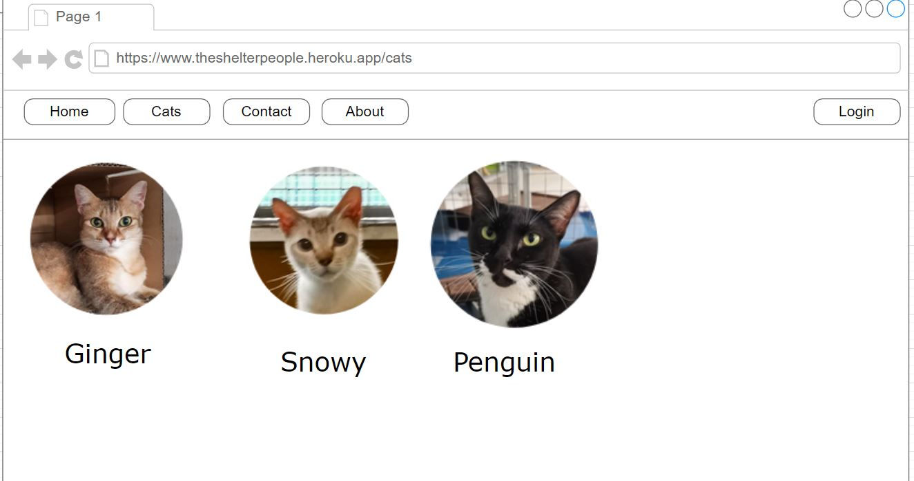
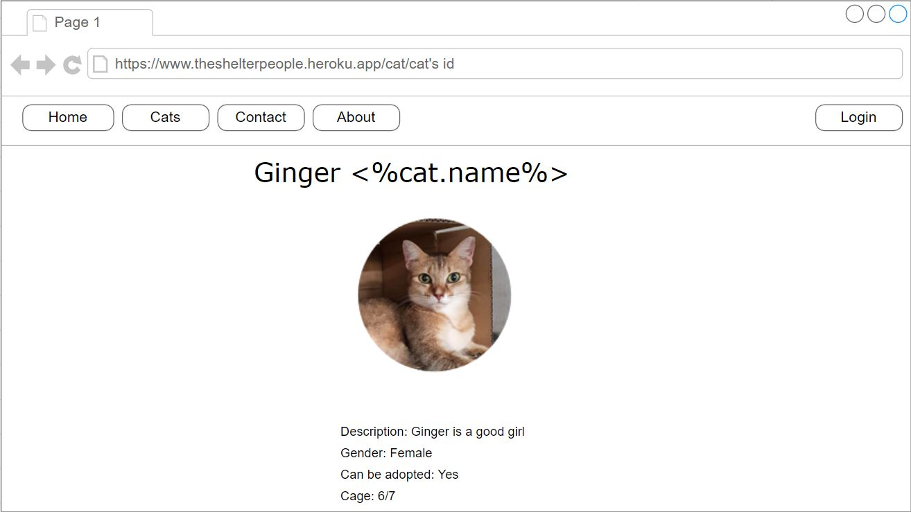

# Project 3: The Shelter People

Animal Shelter Website for TheShelterPeople.

Visit the website here: https://theshelterpeople.herokuapp.com/

## Description
We want to create a useful app that would be of help for the shelter volunteers. They are a volunteer group at Animal Lodge @ sungei tengah.

-	App is meant to help the shelter volunteers to organise their animal details list, raise awareness about the cats + showcase the cats

### Technology Used

```
- MongoDB
- Express
- React
- NodeJS
```

### MVP
- User-facing page: Showing cats + about + contact info (no authentication required to view)
- Authenticated login for Admins to add/update/delete animal details
- Authenticated login for Guest users to leave comments

Suggested pages:
1.	Nav bar: Home/Cats/Contact/About/Sign up/Login
2.	Home page: A short intro about the shelter and the location of the shelter
3.	Cats page: Displays the cats (name, cage, image, description, adoptable, gender)
4.	Contact Page: Link to theshelterpeople’s instagram at @theshelterpeople_sg + address + map 
5.	About page: Explain more about the team behind the website, i.e. GA SEI-32 Group + TheShelterPeople
6.  Sign up page: Sign up for new user account
7.	Login Page for: 
a.	Admin: Login page for admin to edit/add/delete cats. Only admin can do so, we don’t want people from outside meddling with the pages and cat list.
b. Guest user: Login to be able to leave a comment.

### Wireframes




### User Stories

There will be 2 main groups of users: Admin and Guest.

Admin users:
The shelter people volunteers and they are able to create/read/update/delete the cats.

Guest users:
Be it logged in or not, they can browse the website.
However, guest users who are logged in can add comments for the cats.

```
To use the app, user should:

- Select "cats" from the navbar
- View all the cats at a glance
- Click on a particular cat to see specific details about the cat
- User can register an account and login to add comments
- CRUD features for Admin users only
- Users can refer to other pages on navbar (Home/About/Contact) too

```

---

### General Approach / Problem-Solving Strategy
Our plan is to have 3 models: cats, comments, and users.

Cats model (for CRUD): id, name, cage, image, description, adoptable, gender.
Comments model: id, user id, text, cat id, timestamp.
User model: id, username, email, password, role.

Starting with the express backend - our models, controllers and mongoDB was set up.


### Unsolved problems

Unsolved problems here...

## Installation instructions for dependencies
<!-- Fill up as the project goes along... -->
npm installation

```
React frontend:
- React
- React-router-dom
- React-router
- Axios
- Styled Components
- @react-google-maps/api
- React-instagram-embed
```

```
Express backend:
- Express
- Express-sessions
- NodeJS
- Dotenv
- Bcrypt
```